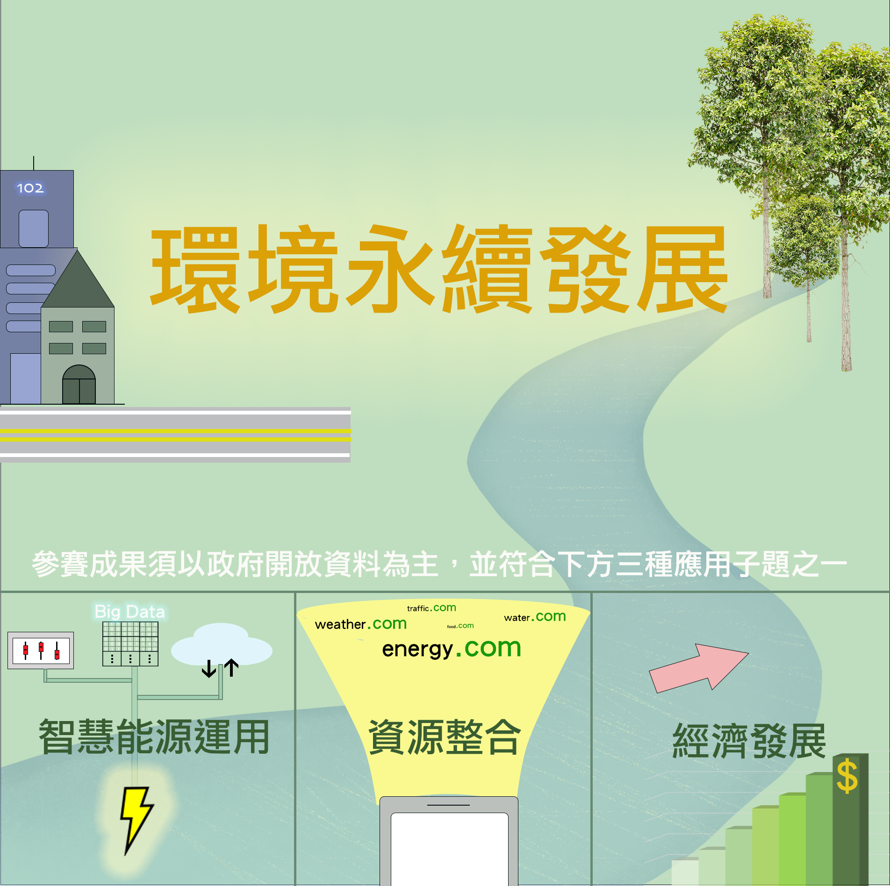

```{css, echo=F}
h1.title {
    font-size:35px;
    /* align-content: center; */
    text-align: center;
}
```
___

<div class="divborder2">
<font class="highlight"> 主題 </font></br>
<p style="font-size: 40px">
  環境永續發展
</p>
<font class="highlight"> 應用子題 </font></br></br>
<p style="font-size: 20px">
  1.智慧能源運用 </br>
  2.資源整合  </br>
  3.經濟發展  </br>
</p>
<font class="highlight"> 規則 </font></br></br>
<p style="font-size: 20px">
  參賽成果須以政府開放資料為主並至少符合三項應用子題之一。
</p>
</div>

___

<center></center>